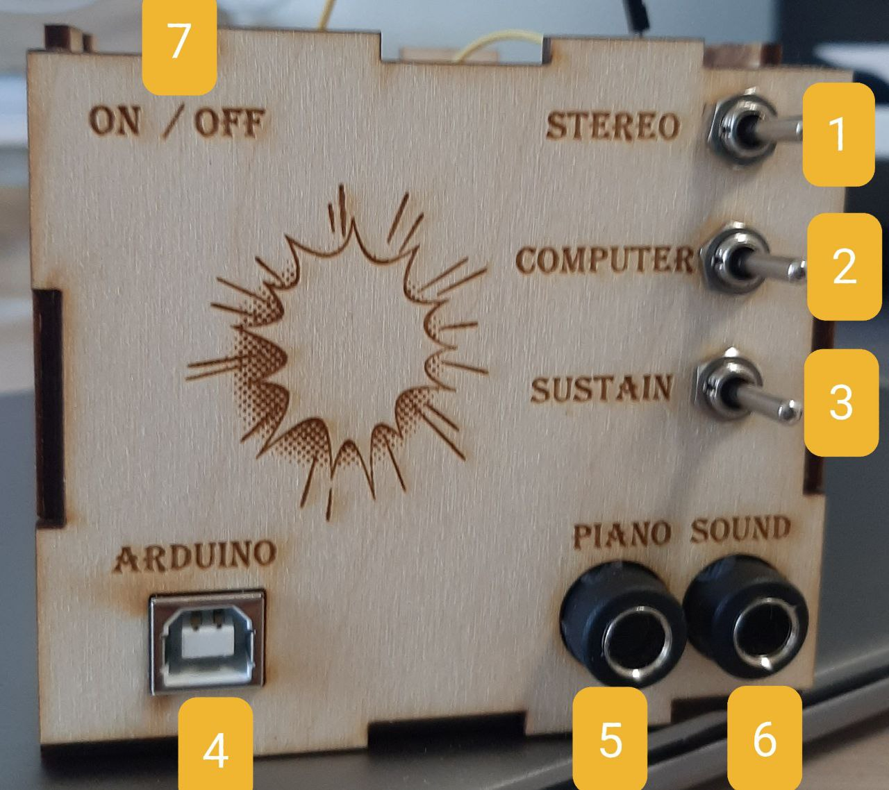
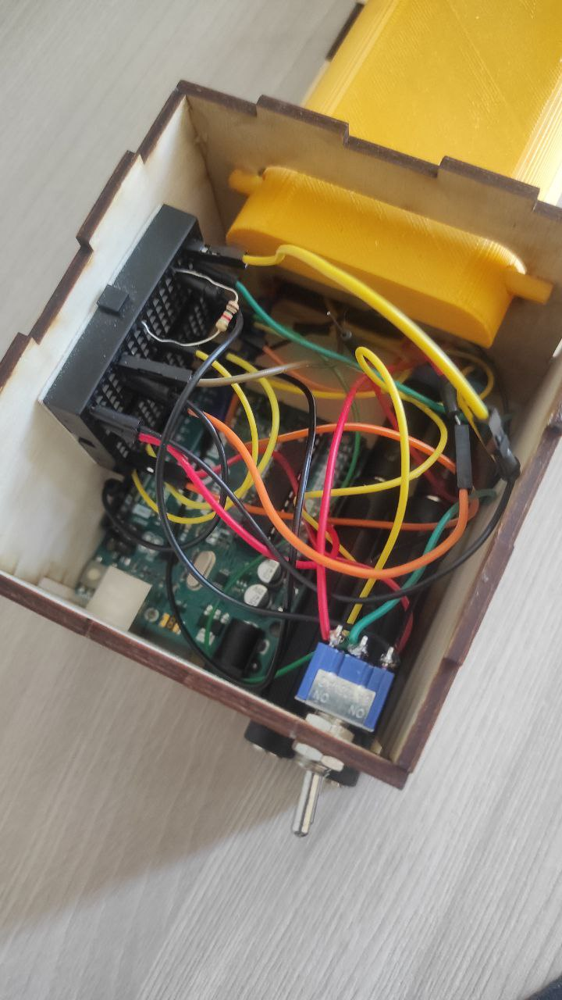
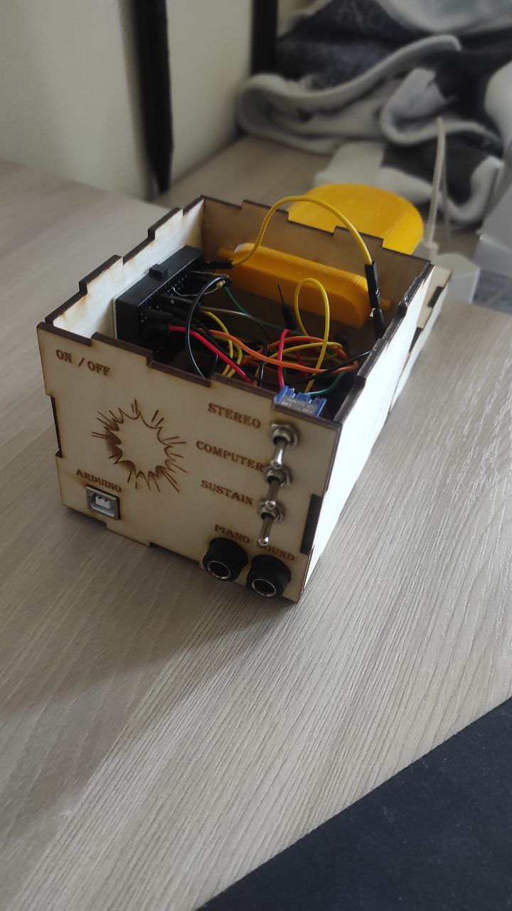
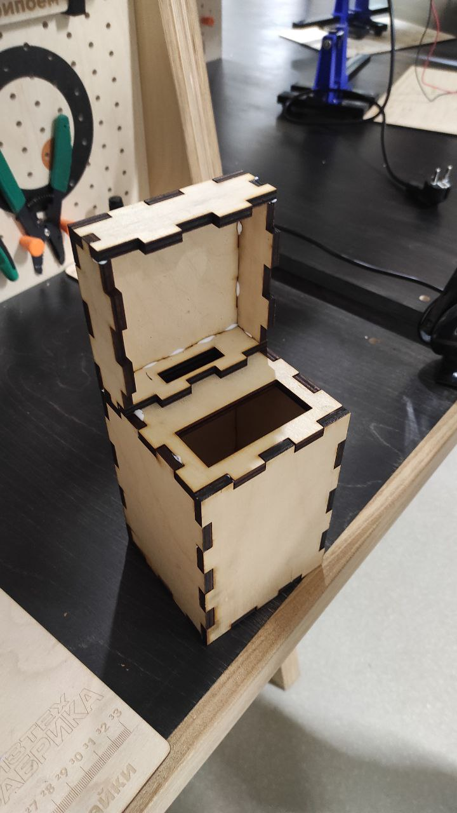
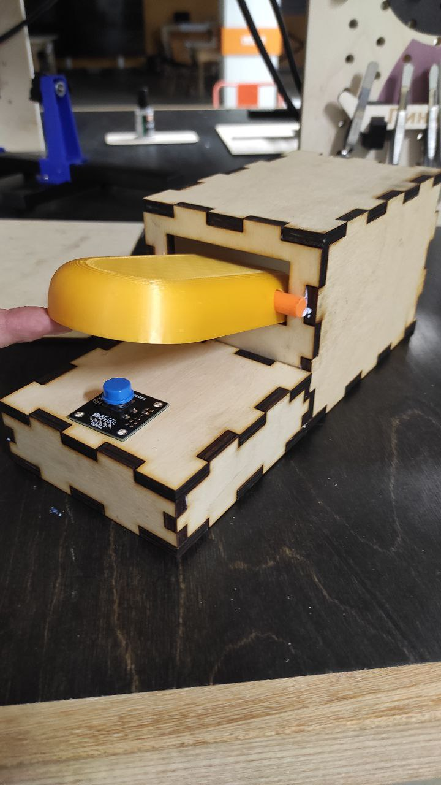
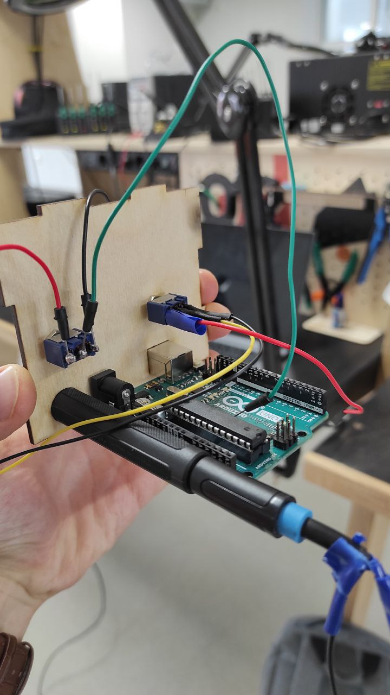
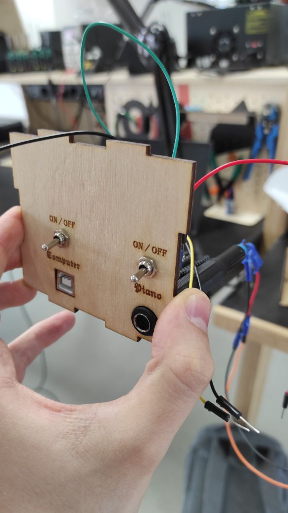

# Универсальная музыкальная педаль

## Разработчики

Студенты 4го курса бакалавриата МФТИ

* Гончаров Марк Александрович
* Кузнецова Маргарита Витальевна

## Описание продукта

* Детальное описание вы можете посмотреть в [документации](Description.pdf).
* Использование продукта представлено в [видео](https://disk.yandex.ru/i/_qlnVe1XMdRhBA).

Данную педаль можно использовать в различных целях, таких как:

1. Сустейн для синтезатора
2. Генератор инструментального фона для стерео системы
3. Контроль вывода звука в систему
4. Контроль работы компьютера 

А также одновременное комбинирование данных функций.

## Внутреннее устройство

1. Тумблер для вывода звука в стерео-систему
2. Тумблер для обработки нажатия педали для вывода в "Ардуино"
3. Тумблер для обработки нажатия педали для вывода в синтезатор
4. USB 2.0 вход для подключения к внутреннему Arduino UNO
* Порт 8 - input - приём состояния нажатия кнопки
* Порт 10 - output - вывод в стерео-систему
5. Джек 6.3 - подключение к синтезатору
6. Джек 6.3 - подключение к стерео-системе
7. Формат работы тумблеров

### Использование продукта

| Функция | 1 - Стерео система | 2 - Ардуино | 3 - Синтезатор | 
|----------|----------|----------|----------|
| Сустейн | OFF | OFF | ON | 
| Компьютер | OFF | ON | OFF | 
| Стерео-система | ON |OFF | OFF | 
| Бас-педаль | OFF | ON | OFF | 
| Фон синтезатора  | ON | OFF | ON | 

## Процесс изготовления:

##### Вам понадобятся:
* Arduino (любой, но для контроля компьютера лучше Leonardo)
* Фанера 3мм
* Соединительные провода
* 3 тумблера
* Небольшая макетная плата
* Кнопка
* Два разъёма 6.3M-6.3M
* Клей по дереву
* Время

##### Последовательность действий
* Скачать [STL корпуса](Pedal_v2.STL)
* Вырезать по красным линиям любым удобным способом. В нашем проекте, использовалась лазерная резка.
* Не забудь сделать красивые гравировки на крышке и по бокам!
* Просверлить отверстия под кнопку и вкрутить её.
* Склеить корпус кроме верхней и боковой крышки для более удобной конфигурации проводов. ВАЖНО: провода от кнопки необходимо вытащить в главный ящик - больше возможности её конфигурации не будет
* Скачать [язычок педали](tube_v2.STL) и напечатать на 3D принетере, используя любой понравившийся цвет
* Склеить вращающий элемент с крышкой согласно рисункам
* Вставить ардуино, звуковые переходники, не забыдь записать пины для звука и кнопки в ардуино.
* Вставить тумблеры, заранее все контакты изолировать, при необходимости контакты припаять.
* Соединить провода как показано на схемах в [документации](Description.pdf)
* Доклеить корпус
* Наслаждаться функционалом инструмента!

## Внутреннее устройство

## Фотографии стадий разработки

