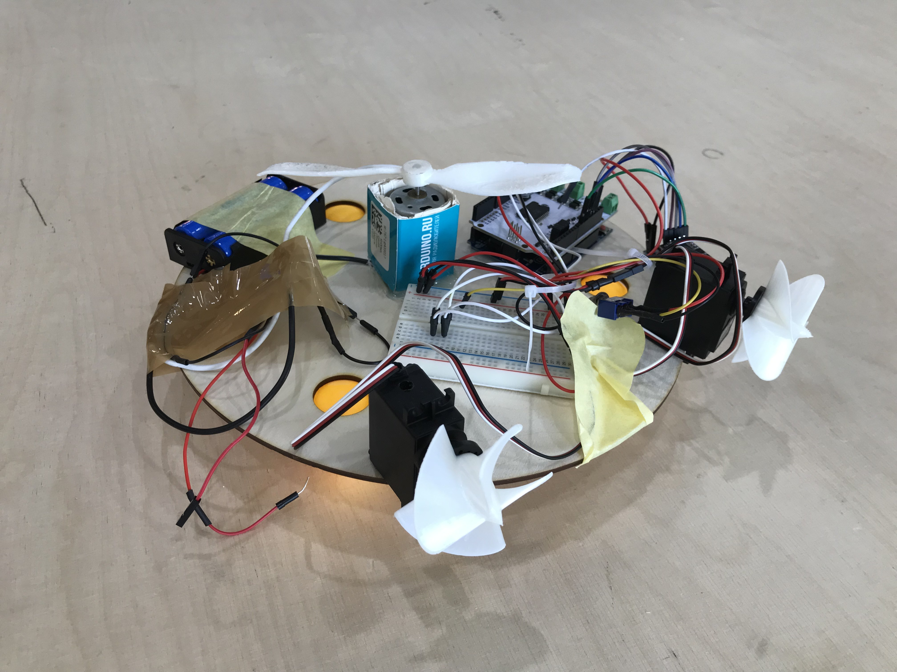

# Ping-pong robot

## Принцип работы

Засчёт шаров для настольного тенниса идёт передвижение. Моторы в горизонтальном положении позволяют корректировать направление движения робота. Основной силовой вертикальный пропеллер имеет ассиметричный вес, что позволяет конструкции попрыгивать. 

